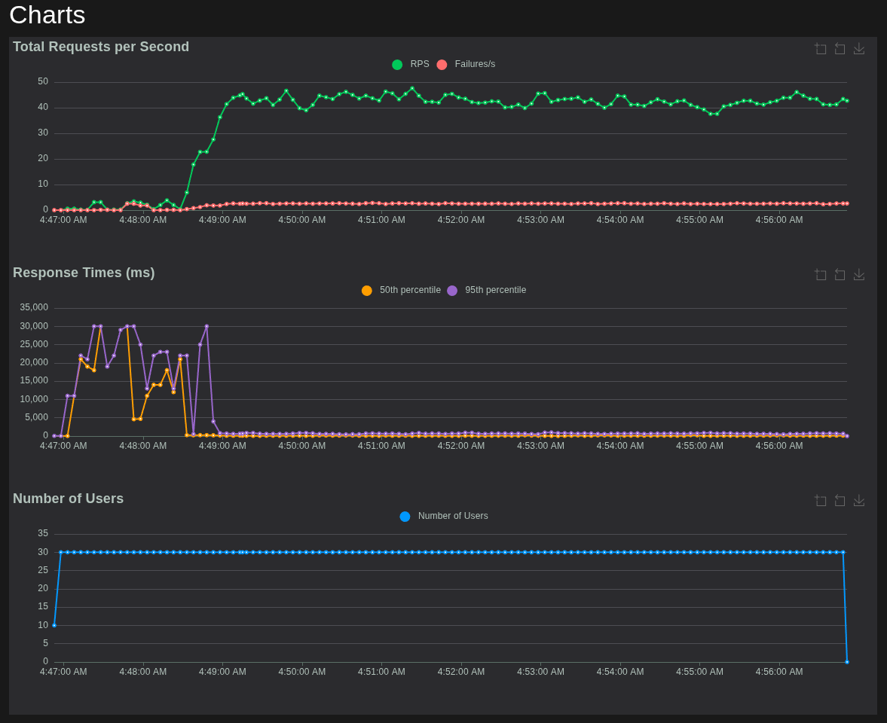
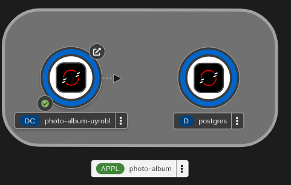

# Felhoalapu_HF1

## Lab 4

I was already using `app-template.yaml` (and `locust.yaml` for lab 3's loadgenerator) to define most of my resources on OKD. Now all application and infrastructure resources are described declaratively in [openshift/app-template.yaml](openshift/app-template.yaml) and I modified the previous Github workflow (lab 2) to not just build on push but deploy the infrastructure and app to OKD as well. 

The template defines the full runtime stack for the photo album application, including both the application server and the database:

- App resources: `Secret`, `ImageStream`, `BuildConfig`, `DeploymentConfig`, `Service`, `Route`, `HorizontalPodAutoscaler`
- Database resources: PostgreSQL `Service`, PostgreSQL `Deployment`, PostgreSQL `PersistentVolumeClaim`, PostgreSQL `NetworkPolicy`

The main change is that now the database deployment is also managed by the same template, so the repo defines the full runtime topology instead of assuming a pre-existing PostgreSQL instance.

Persistent storage is provided through a PersistentVolumeClaim, so database data is preserved across application updates and redeployments (just as before).

### Deployment Flow

GitHub Actions is the only automated deployment path.

1. Run `uv run python manage.py test` with `USE_SQLITE=1`.
2. Log in to OpenShift.
3. Run [scripts/openshift/apply-template.sh](scripts/openshift/apply-template.sh) to validate required inputs, render the template, and `oc apply` the resulting resources.
4. Run [scripts/openshift/wait-for-postgres.sh](scripts/openshift/wait-for-postgres.sh) to wait for the PostgreSQL PVC to bind and for the PostgreSQL deployment to become available.
5. Start the app image build explicitly with `oc start-build bc/$APP_NAME --wait --follow`.
6. Run [scripts/openshift/run-migrations.sh](scripts/openshift/run-migrations.sh) to execute `python manage.py migrate --noinput` exactly once from the newest running pod of the current app rollout.
7. Wait for `oc rollout status dc/$APP_NAME --watch=true`.
8. Smoke-check the route via `/healthz/live/` and `/healthz/ready/`.

If any step fails, the workflow fails immediately.

### Required GitHub Configuration

GitHub repository secrets:

- `OPENSHIFT_SERVER`
- `OPENSHIFT_TOKEN`
- `OPENSHIFT_NAMESPACE`
- `DJANGO_SECRET_KEY`
- `POSTGRES_PASSWORD`

GitHub repository variables:

- `OPENSHIFT_APP_NAME`
- `OPENSHIFT_ALLOWED_HOSTS`
- `OPENSHIFT_CSRF_TRUSTED_ORIGINS`
- `OPENSHIFT_POSTGRES_DB`
- `OPENSHIFT_POSTGRES_USER`
- `OPENSHIFT_POSTGRES_IMAGE`

Optional repository variables:

- `OPENSHIFT_CPU_REQUEST`
- `OPENSHIFT_CPU_LIMIT`
- `OPENSHIFT_MEMORY_REQUEST`
- `OPENSHIFT_MEMORY_LIMIT`
- `OPENSHIFT_POSTGRES_STORAGE_SIZE`
- `OPENSHIFT_POSTGRES_CPU_REQUEST`
- `OPENSHIFT_POSTGRES_CPU_LIMIT`
- `OPENSHIFT_POSTGRES_MEMORY_REQUEST`
- `OPENSHIFT_POSTGRES_MEMORY_LIMIT`
- `OPENSHIFT_GUNICORN_WORKERS`
- `OPENSHIFT_POSTGRES_CONN_MAX_AGE`

## Lab 3

My loadtest report can be found in [loadtest_report.md](loadtest/loadtest_report.md)
A summary of the configuration can be found in [scaling_configuration.md](loadtest/scaling_configuration.md)

I reran the test without raising AssertionErrors on registration:
[new locust data report](loadtest/Locust_2026-04-20-02h46_locustfile.py_https___photo-album-uyrobl-photo-album-uyrobl.apps.okd.fured.cloud.bme.hu.html)

Now the number of users is `30` and stable, pods scale to `5`, Failure ratio is `0.6`. But I will not update my report, because I think the lesson that I learnt is more important: **maybe it's not my app that's wrong but my test**.

Final Locust charts:

(If requested I will update [scaling_configuration.md](loadtest/scaling_configuration.md))

## Lab 2

Finished Django photo album implementation with:
- Photo upload and delete
- Photo listing with sorting by name or upload date
- Clickable list entries with image preview
- Auth (registration, login, logout)
- Restricted upload/delete to authenticated users only
- Deployed on BME OpenShift (OKD)
- Persistent database (PostgreSQL instead of in-memory storage)
- Separate app and database layers for scalable deployment
- Configured automatic GitHub-triggered build/deploy pipeline
- Nicer UI (by gpt-5.4 using [frontend-design skill](https://github.com/anthropics/claude-code/blob/main/plugins/frontend-design/skills/frontend-design/SKILL.md))

#### Pods running in OKD:

### Documentation

#### Architecture

- Backend: Django web application, which implements the user interface and business logic.
- Data layer: PostgreSQL is used for persistent storage; uploaded images and their metadata are stored in the database.
- Runtime: the application runs in a container and is served by Gunicorn; database migrations are applied during startup. (not since Lab 3)
- Configuration: runtime settings are provided through environment variables, including secret key, host settings, and database connection parameters.

#### Tech Stack

- Django 6
- Python 3.13
- uv python package manager
- PostgreSQL
- Gunicorn
- Docker
- OpenShift / OKD
- GitHub Actions

#### OKD Deployment
- Hosting is defined through an OpenShift template describing the application resources.
- The deployment uses separate OpenShift objects for secrets, image stream, build configuration, deployment configuration, service, and public route.
- The web application and the database are separated into different layers, so the app container remains independent from the persistence service.
- External traffic enters through an HTTPS route, passes through the internal service, and reaches the Django container in the cluster.
- Health checks and resource limits are defined in the deployment to support stable runtime behavior.

#### GitHub Workflow
- A GitHub Actions workflow is triggered on pushes to the `master` branch.
- The first stage runs the Django test suite in CI before deployment is allowed.
- After successful validation, GitHub Actions connects to the BME OKD project and starts a new OpenShift build.
- OpenShift builds the image, updates the image stream, and rolls out the new application version automatically.
- Repository secrets and variables are used to keep platform credentials and deployment identifiers outside the source code.

## Lab 1

Django photo album implementation with:

- In-memory data store (no persistent database)
- No authentication
- Photo upload and delete
- Photo listing with sorting by name or upload date
- Clickable list entries with image preview
