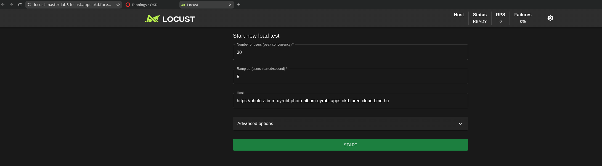
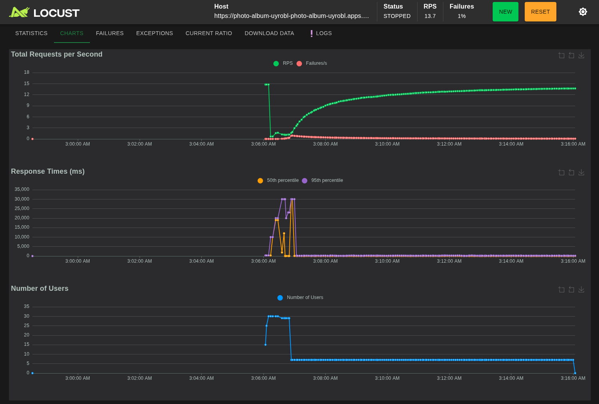
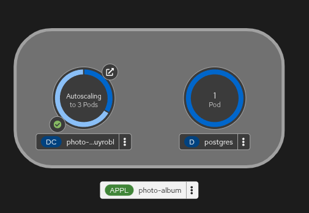
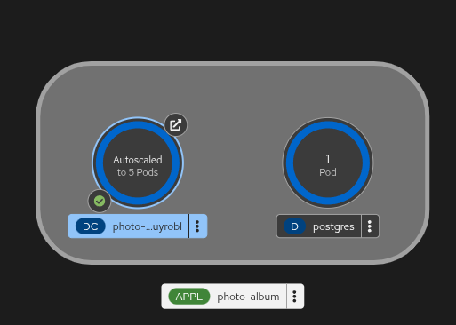
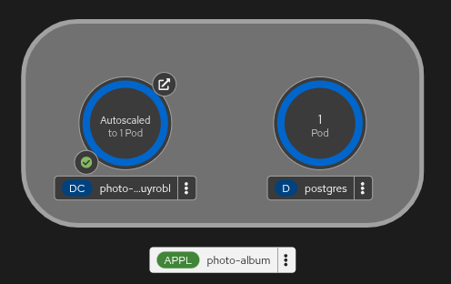

# Load Test Report

## Goal

I deployed the load generator as a separate application in the `lab3-locust` OKD project, so the performance test was executed from the cloud rather than locally from my pc.

## About the test

- system under test: `https://photo-album-uyrobl-photo-album-uyrobl.apps.okd.fured.cloud.bme.hu`
- load generator: Locust deployed from [`locust.yaml`](./locust.yaml)
- load script: [`locustfile.py`](./locustfile.py)
- saved report: [`Locust_2026-04-20-01h06_locustfile.py_https___photo-album-uyrobl-photo-album-uyrobl.apps.okd.fured.cloud.bme.hu.html`](./Locust_2026-04-20-01h06_locustfile.py_https___photo-album-uyrobl-photo-album-uyrobl.apps.okd.fured.cloud.bme.hu.html)

## Locust Scenario

The Locust scenario uses the `AlbumUser` user class and uses the application's main features:

- register a new user
- open the archive page
- upload a photo
- open the preview page for the uploaded photo
- fetch the raw image content
- delete the uploaded photo

This covers the main functional requirements listed in the assignment:

- photo upload
- photo retrieval
- photo deletion

## Test Configuration

The load test was started from the Locust web UI with the following settings:

- peak concurrency: `30` users
- ramp-up: `5` users per second
- target host: `https://photo-album-uyrobl-photo-album-uyrobl.apps.okd.fured.cloud.bme.hu`
- duration: `10 minutes`

(Locust was running in the cloud, as can be seen in the URL bar.)

## Request Statistics

| Metric | Value |
| --- | --- |
| Total requests | `8215` |
| Total failures | `49` |
| Failure ratio | `0.59%` |
| Average throughput | `13.70 RPS` |
| Average response time | `242.46 ms` |
| Median response time | `44 ms` |
| 95th percentile | `210 ms` |
| 99th percentile | `380 ms` |

Endpoint-level highlights from the report:

| Endpoint | Requests | Failures | Avg response time |
| --- | ---: | ---: | ---: |
| `GET /` | `1651` | `22` | `94.48 ms` |
| `GET /?selected=` | `1625` | `0` | `103.68 ms` |
| `GET /photos/:id/image/` | `1625` | `0` | `38.54 ms` |
| `POST /photos/:id/delete/` | `1625` | `0` | `67.29 ms` |
| `POST /photos/upload/` | `1629` | `4` | `137.56 ms` |
| `GET /register/` | `30` | `0` | `15499.60 ms` |
| `POST /register/` | `30` | `23` | `26876.85 ms` |

## Interpretation of Failures

The failures were concentrated in the first minute of the run, during initial user creation and the first heavy burst of requests:

- `GET /` had `22` failures, mainly `503`
- `POST /register/` had `23` failures with `504`
- `POST /photos/upload/` had `4` failures with `504`

This indicates that the initial burst was strong enough to overload the single starting replica before HPA had enough time to scale the application out.

After the application scaled, the remaining part of the 10-minute run was much more stable and showed:

- about `10` to `15.0` RPS
- no ongoing failures
- response times returning to the tens or low hundreds of milliseconds for the main archive, preview, image, upload, and delete flows

One important detail from this run is that the active Locust user count did not stay at `30` for the whole test. The charts show the target user count ramping up to `30`, then dropping to roughly `7` active users after the early assertion-triggered failures. In other words, the run clearly demonstrates scale-up and later stable request handling, but it is not a sustained 30-user steady-state test from start to finish.

## The Possible Reasons of Failures
1. The most likely reason of only `7` users being sustainable is that I raise AssertionError in Locust on registration fail. I'm 90% sure that if I added a retry logic that just simply retries once 1 minute after fail would solve it, because it takes time to launch new pods.
2. Not enough Gunicorn workers.
3. THe HPA doesn't react fast enough to the initial spike.

## Charts

The Locust charts show three important things:

- the user count rose to `30`
- the response times spiked sharply during the initial overload period
- the active user count later settled around `7`
- request throughput later stabilized once multiple application replicas were available

## Proof of Scale-Up

The OKD topology screenshots show that the application scaled above the initial single pod:

- during the test the application reached `3` pods

- the maximum observed scale was `5` pods (as set up in the HPA)

This is direct evidence that the HPA reacted to the generated CPU pressure and increased the replica count up to the configured maximum.

## Proof of Scale-Down

After the load test was stopped, the application did not scale down. A few minutes later, the replicas were reduced again, and after roughly `6` minutes the topology showed the application back at a single pod.

This matches the configured HPA behavior:

- the HPA uses a `300` second scale-down stabilization window

Final scale-down evidence:

## Summary

The load test achieved the main purpose of the exercise:

- it was executed from the cloud using a separate OKD-hosted Locust deployment
- it exercised the application's main functions
- it triggered automatic scale-up from `1` pod to `5` pods
- after the load was removed, the application scaled back down to `1` pod

The run gives a clear picture: startup and registration is the weak point, but once the application had scaled out, the main archive, preview, image, upload, and delete flows stayed responsive and failure-free for the rest of the test.
