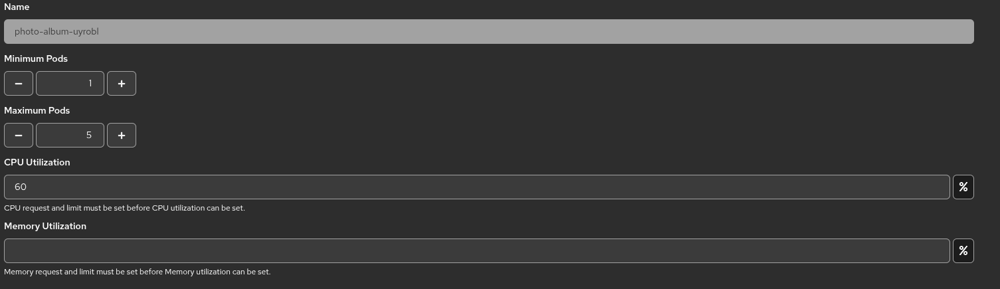

# OKD Automatic Scaling Configuration

# The final setup uses:

- `photo-album-uyrobl` project for the application and PostgreSQL database
- `lab3-locust` project for the Locust load generator
- an `autoscaling/v2` HorizontalPodAutoscaler targeting the application's `DeploymentConfig`

## Deployed Architecture

The deployed application consists of the following OKD resources:

- `BuildConfig` and `ImageStream` for building the application image from GitHub
- `DeploymentConfig` for the Django/Gunicorn application
- `Service` and `Route` for exposing the application
- `HorizontalPodAutoscaler` for CPU-based automatic scaling
- a separate PostgreSQL deployment used as the persistent data store

The application and database are intentionally separated. The scaling target is the web application layer, not the database layer. (The load generator is in a separate OKD project.)

## Application Runtime Configuration

The scaling-related runtime configuration comes from [`openshift/app-template.yaml`](../openshift/app-template.yaml):

| Setting | Value |
| --- | --- |
| CPU request | `50m` |
| CPU limit | `250m` |
| Memory request | `256Mi` |
| Memory limit | `512Mi` |
| HPA minimum replicas | `1` |
| HPA maximum replicas | `5` |
| HPA target CPU utilization | `60%` |

The `DeploymentConfig` uses the following health checks:

- readiness probe: `GET /healthz/ready/`
- liveness probe: `GET /healthz/live/`
- startup probe: `GET /healthz/live/`

I implemented these endpoints in the Django application to allow OKD to route traffic only to healthy pods.

## Horizontal Pod Autoscaler

The HPA targets the application `DeploymentConfig` and scales based on CPU utilization. The final HPA configuration was:

- minimum replicas: `1`
- maximum replicas: `5`
- target CPU utilization: `60%`
- scale-down stabilization window: `300` seconds

This low CPU request and moderate target were chosen intentionally so that a relatively small cloud load test would be enough to demonstrate scale-up.

## Evidence of Successful Configuration

The following observations confirm that the scaling configuration was active:

- the HPA object existed in OKD with the expected min/max/CPU target values
- the application scaled from `1` pod up to `5` pods during the load test
- after the test stopped, the application scaled back down to `1` pod

The screenshots and measured results are documented in [`loadtest_report.md`](./loadtest_report.md).
